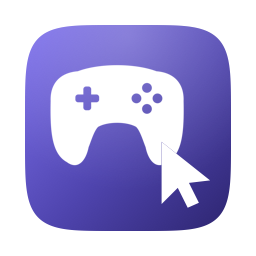

<p align="center">
  
</p>

<h1 align="center">CouchPilot</h1>

<p align="center">
  <b>Control your Mac from the couch with a game controller.</b><br>
  Cursor, clicks, scrolling, media keys, Mission Control — from a menu bar app that weighs 1.5 MB.
</p>

<p align="center">
  
  
  
  
</p>

<p align="center">
  <a href="README.it.md">Leggilo in italiano</a>
</p>

---

Written in Swift with **zero external dependencies** and **zero data collection**. Connect a controller and your Mac answers to it — no configuration required to start.

## Features

- **Cursor** on the left stick — smooth sub-pixel movement, adjustable speed, deadzone and response curve, multi-monitor aware
- **Click, drag, double click, right click** on A and X
- **Scrolling** (vertical and horizontal) on the right stick
- **Media keys**: play/pause, volume with hold-to-repeat, previous/next track
- **Mission Control, Spaces, Show Desktop** — invoked through *your* configured macOS shortcuts, so remappings are respected
- **Precision mode** (hold R2, ¼ speed) and **turbo** (hold L2, ×2) for cursor and scrolling
- **Configurable stick buttons** (L3/R3): middle click, mute, brightness, screenshot and more
- **Controller battery indicator** in the menu, macOS style
- **Auto-pause in games**: when a game or a chosen app (GeForce Now and Steam are preloaded) is frontmost, CouchPilot steps aside and the controller belongs to the game
- **Localized**: English, Italian, Spanish, Simplified Chinese — follows the system language by default
- Global on/off toggle: hold the Menu (☰) button for 2 seconds

## Controls

| Input | Action |
|---|---|
| Left stick | Move the cursor |
| A | Left click (hold to drag) |
| X | Right click |
| Right stick | Scroll vertically/horizontally |
| B | Mission Control |
| Y | Play/Pause |
| D-pad up/down | Volume up/down (hold to repeat) — configurable |
| D-pad left/right | Previous / next track — configurable |
| LB / RB | Previous / next Space |
| View (⧉) | Show Desktop |
| R2 (hold) | Precision: ¼ speed |
| L2 (hold) | Turbo: ×2 speed |
| L3 / R3 | Configurable — defaults: Mute / Middle click |
| Menu (☰) held 2 s | Toggle CouchPilot on/off |

The app activates when a controller connects and deactivates when it disconnects (releasing any held button, so a drag never gets stuck).

## Requirements

- macOS 14 or later
- A game controller paired over Bluetooth. Built and tested with Xbox Wireless Controllers; anything exposing the extended gamepad profile (DualSense, DualShock 4, Switch Pro) should work.

## Install

### From a release

1. Download `CouchPilot-1.0.0.dmg` from [Releases](../../releases), open it and drag **CouchPilot** onto the **Applications** shortcut.
2. First launch: macOS will block the app because it is not notarized. Go to **System Settings → Privacy & Security**, scroll down and click **"Open Anyway"**.
3. Grant the **Accessibility** permission when asked (System Settings → Privacy & Security → Accessibility). CouchPilot needs it to move the cursor and press keys — the menu bar icon shows ⚠️ until granted, and a menu item takes you to the right pane.

CouchPilot lives in the menu bar: it has **no Dock icon and no window**, so it won't show up in Launchpad. Look for the controller icon next to the clock.

> Note: after an update you may need to grant Accessibility again — unsigned builds look like a new app to macOS each time.

Comfortable with the terminal? This removes the quarantine flag and skips the whole dialog dance:

```bash
xattr -d com.apple.quarantine /Applications/CouchPilot.app
```

### From source (no Gatekeeper prompts)

```bash
git clone https://github.com/HirpinO59/CouchPilot.git
cd CouchPilot
./build.sh install   # builds and installs into /Applications (plain ./build.sh only builds)
```

Requires the Xcode Command Line Tools (`xcode-select --install`). The script builds with Swift Package Manager, assembles the bundle, generates the icon from code and signs with whatever identity it finds in your keychain (ad-hoc otherwise).

## Settings

Everything lives in the menu bar icon → **Settings**: cursor and scroll speed presets, stick deadzone, response curve, R2/L2 factors, L3/R3 actions, excluded apps, auto-pause in games, language, reset. Changes take effect immediately.

Advanced values outside the presets can be set from the terminal (`UserDefaults` domain `com.hirpino.couchpilot`):

```bash
defaults write com.hirpino.couchpilot maxSpeed -float 1800
```

| Key | Default | Meaning |
|---|---|---|
| `deadzone` | 0.15 | Radial deadzone of the cursor stick |
| `exponent` | 2.0 | Response curve (higher = more precision at low deflection) |
| `maxSpeed` | 1400 | Max cursor speed (px/s) |
| `scrollDeadzone` | 0.20 | Deadzone of the scroll stick |
| `scrollSpeed` | 700 | Max scroll speed (px/s) |
| `precisionFactor` | 0.25 | Speed multiplier while R2 is held |
| `boostFactor` | 2.0 | Speed multiplier while L2 is held |
| `actionL3` / `actionR3` | mute / middleClick | Stick-button actions |
| `actionDpadUp` … `actionDpadRight` | volume / track | D-pad actions, `none` to leave the direction free |
| `excludedApps` | GeForce Now, Steam | Bundle ids that auto-pause CouchPilot |
| `autoPauseGames` | true | Auto-pause when the frontmost app declares itself a game |
| `language` | auto | Menu language: `auto`, `it`, `en`, `es`, `zh` |
| `menuHoldSeconds` | 2.0 | How long to hold ☰ for the toggle |
| `debugLog` | false | Log stick values twice a second (Console.app) |

## Privacy

CouchPilot collects nothing. There is **no network code** in the app — no servers, no analytics, no telemetry. It does **not read your keyboard or mouse**: the Accessibility permission is used to *generate* input events, never to intercept them — the code contains no event tap and no global monitor. Preferences and a small technical log (`~/Library/Logs/CouchPilot.log`) stay on your Mac.

## Known limitations

- Xbox controllers over Bluetooth don't report battery through Apple's GameController API; CouchPilot reads the level from the system's Bluetooth stack instead. Some controllers may show no battery at all.
- Brightness actions may have no effect on external displays (macOS limitation).
- Don't run other controller-mapping apps (Controlly, Enjoyable…) at the same time: both would emit events and inputs double up.
- Xbox controllers auto-sleep after ~15 minutes of inactivity — that's the controller, not the app.
- macOS itself lets a connected controller navigate some system interfaces (Spotlight, Launchpad) with the D-pad, and that cannot be turned off in System Settings. If a D-pad action of yours fires *while* macOS is also moving the selection, set that direction to **No action** in Settings → Buttons.

## Roadmap

Per-app profiles · custom keyboard shortcuts on buttons · D-pad as arrow keys

## Feedback

Use **"Report an issue or idea…"** in the app menu — it opens a pre-filled issue with the technical details already attached (visible and editable before you send) — or [open an issue](../../issues) directly.

---

© 2026 HirpinO. All rights reserved.
